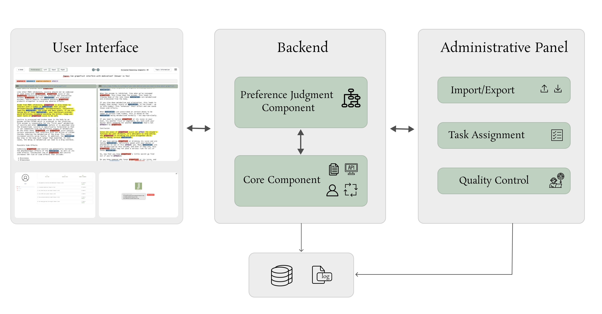

<p align="center">
  
</p>


<div align="center"><p>
    <a href="https://github.com/judgo-system/judgo/pulse">
      
    </a>
    <a href="https://github.com/judgo-system/judgo/blob/main/LICENSE">
      
    </a>
</p>

</div>





## Introduction

> For Python >= 3.8

JUDGO is a python framework for ranking documents based on users' preference and has been used in [TREC 2022 Health Misinformation Track](https://trec-health-misinfo.github.io).

Main features:
 - Supported by a novel preference judgment algorithm.
 - Flexible configuration.
 - Several UI features for acceleration of making decision.
 
 
## Creators

This framework has been designed and developed by the [Data System Group](https://uwaterloo.ca/data-systems-group/) at [University of Waterloo](https://uwaterloo.ca/). 

## Install

### 1. Without Docker

- Step 1: Create an activate a new virtual environment and run:

```
pip install -r requirements/local.txt
```

- Step 2:  Change `judgo.env` file according to your own settings

- Step 3: Execute the following file to setup and run application for the first time.

```
./setup_judgo.sh
```
If you previously run this file and you need to run the system with the previous setting, execute ```./run_judgo.sh```

- Step 4: Open http://0.0.0.0:8000/


### 2. with Docker

 - Step 0: Before install this project make sure your sysytem has `docker` and `docker-compose` installed.

 - Step 1:  Change `docker/.web` file according to your own settings

 - Step 2: Run the following command.

  ```
  docker-compose up --build -d 
  ```

  Step 3- Open http://0.0.0.0:8000/


